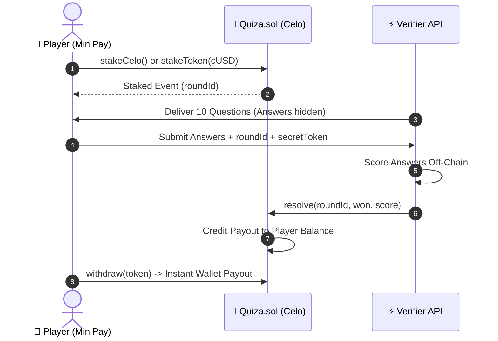

# Quiza 🧠 — Stake. Play. Win.

> **A real-money trivia MiniApp for [MiniPay](https://www.opera.com/products/minipay) on [Celo](https://celo.org)** — Built for **[Proof of Ship Season 2](https://celoplatform.notion.site/)** by Celo Public Goods.

[](https://celoscan.io/address/0x81f2150e2aa7A28c788Ee8D3A2609f03566C5142#code)
[](https://www.opera.com/products/minipay)
[](https://celoplatform.notion.site/)
[](LICENSE)

---

## 🌟 Overview

**Quiza** is a ultra-fast, mobile-first Web3 trivia game where players stake **CELO** or **cUSD** to test their knowledge across Math, Geography, History, and General Knowledge. Score high enough to win back your stake plus progressive bonus payouts — settled instantly on the Celo blockchain directly into your MiniPay wallet.

Designed specifically for MiniPay's 16M+ African & global mobile user base, Quiza removes traditional Web3 friction with sub-second Celo transactions, seamless native stablecoin staking, and intuitive gameplay.

---

## ✨ Key Features

- 🎮 **Multiple Game Modes**:
  - **Stake & Win**: Pick your favorite category and difficulty tier.
  - **Daily Challenge**: 10 fresh questions daily competing for top global ranking.
  - **Practice Mode**: Risk-free gameplay to hone your skills before staking.
- 💰 **Progressive Multipliers**:
  - **7 / 10 Correct**: **1.2x** payout
  - **8-9 / 10 Correct**: **1.5x** payout
  - **10 / 10 Perfect Score**: **2.0x** payout (Double your stake!)
- 🛡️ **Built-in Player Protections**:
  - **`claimTimeout` Refund Guarantee**: Players can reclaim their full stake directly from the smart contract if backend resolution ever times out (> 2 hours).
  - **Anti-Cheat Off-Chain Scoring**: Quiz answer keys are evaluated securely off-chain via backend verifier service, eliminating on-chain answer inspection attacks.
- ⚡ **EIP-2771 Meta-Transactions Ready**: Architecture configured for gasless staking via relayers.
- 🎨 **Dynamic Social Sharing**: Automatically generates dynamic SVG share cards (`/api/og`) and OpenGraph preview pages (`/api/share-card`) for instant sharing on X, Telegram, and WhatsApp.

---

## 🎮 How It Works



1. **Connect**: Tap in using Opera MiniPay wallet (or any Celo-compatible wallet).
2. **Stake**: Choose **CELO** or **cUSD** (e.g. 0.01 CELO or 0.001 cUSD).
3. **Play**: Answer 10 randomized trivia questions against the clock.
4. **Win**: Score 7/10 or higher to win up to **2.0x** your stake!
5. **Withdraw**: Winnings accumulate on-chain and are withdrawable at any time.

---

## 📜 Smart Contract & Mainnet Deployment

The core contract [`Quiza.sol`](./contracts/Quiza.sol) manages player staking, verifier resolution, balance tracking, and withdrawals.

| Network | Contract Address | Explorer Link |
|---|---|---|
| **Celo Mainnet** | `0x81f2150e2aa7A28c788Ee8D3A2609f03566C5142` | [View on Celoscan ↗](https://celoscan.io/address/0x81f2150e2aa7A28c788Ee8D3A2609f03566C5142#code) |
| **Celo Alfajores Testnet** | Configurable in `.env` | [Celoscan Testnet ↗](https://alfajores.celoscan.io) |

### Core Methods

- `stakeCelo()` — Stake native CELO to create a new quiz round.
- `stakeToken(address token, uint256 amount)` — Stake cUSD tokens (requires approval).
- `resolve(uint256 roundId, bool won, uint8 score)` — Called by authorized backend verifier to payout winning rounds based on progressive multiplier tiers.
- `claimTimeout(uint256 roundId)` — Allows players to claim a 100% refund of their stake if a round remains unresolved after 2 hours.
- `withdraw(address token)` — Withdraw accumulated winnings to player's wallet address.

---

## 🏗️ Project Architecture

```
quiza/
├── contracts/
│   └── Quiza.sol              # Smart contract (ERC2771Context, Ownable, ReentrancyGuard)
├── scripts/
│   ├── deploy.js              # Hardhat deployment script for Celo networks
│   ├── dev-runner.js          # Concurrent dev runner (Vite + Express API)
│   └── fund-verifier.js       # Utility script to check/fund verifier gas
├── src/
│   ├── pages/                 # Home, Quiz, Results, Leaderboard, Setup, Profile screens
│   ├── components/            # StakeModal, ShareModal, Navbar, UI components
│   ├── lib/                   # quizaContract.js, firebase.js, web3 integration
│   └── App.jsx                # Main React router & global state management
├── api/
│   ├── round-questions.js     # Serves randomized questions (without answers)
│   ├── verify-round.js        # Scores answers & submits resolve() on-chain
│   ├── verify-practice.js     # Zero-stake practice mode verification
│   ├── og.js                  # Dynamic SVG OpenGraph image generator
│   ├── share-card.js          # Social share HTML preview card generator
│   └── leaderboard.js         # Global rankings & score syncing
├── hardhat.config.js          # Celo Mainnet & Alfajores network configs
├── index.html                 # App entry + Talent App verification tag
└── server-dev.js              # Local Express API server for local dev
```

---

## 🛠️ Tech Stack

- **Smart Contracts**: Solidity `^0.8.20`, OpenZeppelin Contracts, Hardhat
- **Chain & Wallet Integration**: Celo Mainnet, EIP-1193 MiniPay Provider, Ethers.js v6
- **Frontend**: React 18, Vite, Tailwind CSS, Framer Motion, Lucide Icons
- **Backend & Verification**: Node.js, Express, Firebase Firestore (Leaderboards & Session Tokens)
- **Deployment**: Vercel (Frontend & Serverless API), Celoscan Verification

---

## 🚀 Getting Started

### Prerequisites

- Node.js `^18.0.0`
- npm `^9.0.0`

### Installation & Local Setup

1. **Clone the repository**:
   ```bash
   git clone https://github.com/your-username/quiza.git
   cd quiza
   ```

2. **Install dependencies**:
   ```bash
   npm install
   ```

3. **Configure Environment Variables**:
   Copy `.env.example` to `.env` and fill in your values:
   ```bash
   cp .env.example .env
   ```
   ```env
   DEPLOYER_PRIVATE_KEY=your_private_key
   QUIZA_VERIFIER_ADDRESS=0x_verifier_wallet_address
   QUIZA_VERIFIER_PRIVATE_KEY=your_verifier_private_key
   QUIZA_NETWORK=mainnet
   CELOSCAN_API_KEY=your_celoscan_api_key
   ```

4. **Start Development Environment**:
   Run frontend Vite dev server and Express API simultaneously:
   ```bash
   npm run dev:all
   ```
   - App will be running at `http://localhost:5173`
   - Local API running at `http://localhost:3001`

---

## 🧪 Testing & Verification

### Run Linter
```bash
npx oxlint --ignore-path .gitignore .
```

### Compile Smart Contracts
```bash
npm run compile
```

### Verify Contract on Celoscan (Mainnet)
```bash
npm run verify:mainnet -- 0x81f2150e2aa7A28c788Ee8D3A2609f03566C5142 0x765DE816845861e75A25fCA122bb6898B8B1282a <VERIFIER_ADDRESS>
```

---

## 🏅 Proof of Ship Season 2

Quiza is actively participating in **Celo's Proof of Ship Season 2**.

- **Talent App Project Verification**: Tag embedded in [`index.html`](./index.html#L7).
- **Verified Smart Contract**: Deployed & verified on Celo Mainnet (`0x81f2150e2aa7A28c788Ee8D3A2609f03566C5142`).
- **MiniPay Hook Integrated**: Complete provider detection and native flow optimized for Opera MiniPay.

---

## 📄 License

This project is licensed under the [MIT License](LICENSE).
