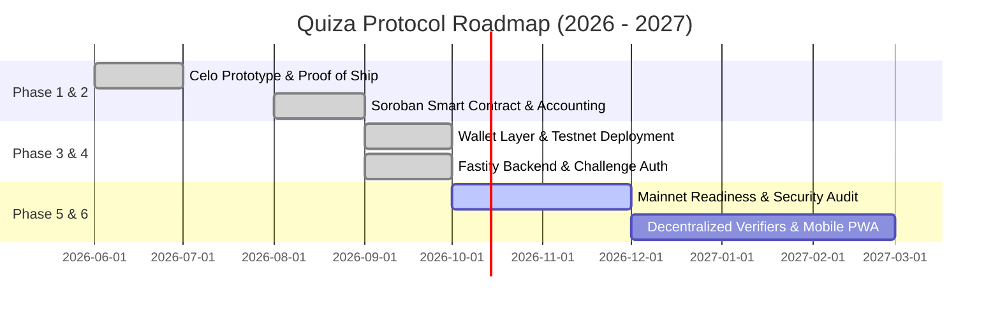

# Quiza Engineering Roadmap

This document outlines the strategic engineering roadmap and technical milestones for **Quiza**. Our mission is to build the premier high-throughput, non-custodial Web3 trivia and skill-gaming platform powered by the Stellar network and Soroban smart contracts.

---

## Strategic Goals

1. **Uncompromised Security**: Mathematical guarantees that house liquidity, locked stakes, and player balances remain strictly solvent.
2. **Sub-5-Second Latency**: Leverages Stellar's fast consensus and optimistic UI updates for instant feedback.
3. **Frictionless Onboarding**: Eliminates crypto friction through fee-bump transaction sponsorship and seamless Freighter wallet integration.
4. **Decentralized Verifiability**: Progressively decentralizes answer verification from trusted server execution to cryptographic attestation.

---

## Development Phases & Milestones

---

### Phase 1: Prototype & Market Validation (Completed ✅)
- Initial Proof of Ship Season 2 MiniApp built on Celo Alfajores testnet.
- Core 10-question trivia game loop with category selection.
- Basic EVM escrow smart contract with verifier resolution.
- Dynamic social share cards for X, Telegram, and WhatsApp.

---

### Phase 2: Soroban Smart Contract Architecture (Completed ✅)
- Migration from EVM to Rust-based Soroban smart contracts on Stellar (`contracts/quiza`).
- Formalized 3-pool liquidity accounting invariant:
  $$\text{Real Token Balance} == \text{pool} + \text{locked} + \text{owed}$$
- Multi-token support via Stellar Asset Contract (SAC) for native XLM and testnet USDC.
- Progressive payout multiplier tiers (1.2x at score 7, 1.5x at score 8–9, 2.0x at score 10).
- Non-custodial 2-hour timeout refund mechanism (`claim_timeout`).
- Comprehensive unit and snapshot test suite covering edge cases and arithmetic invariants.

---

### Phase 3: Stellar Wallet Integration & Testnet Deployment (Completed ✅)
- Integration with Freighter wallet extension (`@stellar/freighter-api` and `@stellar/stellar-sdk`).
- Real-time balance retrieval via Horizon and read-only Soroban RPC simulation.
- USDC changeTrust trustline auto-setup helper.
- Testnet deployment to contract ID `CBD7PCUZDB22HJV7LHO4QHRIEZXSWED5OHJ256623PVLT46XGSKSC7IV`.
- Initial pool funding for testnet XLM and USDC.

---

### Phase 4: Production Backend & Challenge Authentication (Completed ✅)
- Fastify + TypeScript backend architecture (`apps/api`) with PostgreSQL persistent storage.
- Anti-griefing ownership challenge flow: single-use nonce signed via Freighter SEP-53 message signing, exchanging for an HMAC-signed, address-bound 15-minute session token.
- Question bank expansion and validation across all categories.
- Offline verifier background queue with automated retry worker and 100-minute resolution warning sweeper.
- Two-step timeout claim and retry-withdrawal flow with contract balance detection on page reload.

---

### Phase 5: Mainnet Readiness, Cleanup & Security Audit (Current 🟡)
- **Deprecation Cleanup**: Remove legacy Celo EVM contracts, Hardhat scripts, and legacy Firebase services.
- **Contract Formal Verification**: Independent security audit of the Soroban contract by a certified Stellar auditor.
- **Admin Multisig Setup**: Transition admin keys to an $M$-of-$N$ threshold multisig Stellar account.
- **Mainnet Deployment**: Deploy `QuizaContract` to Stellar Mainnet and seed initial house liquidity for XLM and USDC.
- **Monitoring & Alerting**: Prometheus/Grafana metrics for RPC latency, verifier wallet gas reserves, and round completion rates.

---

### Phase 6: Ecosystem Growth & Protocol Decentralization (Future 🚀)
- **Stellar Fee-Bump Sponsorship**: Implement SEP-0029 fee-bump transactions so sponsored new players can stake without pre-funding XLM gas reserves.
- **Mobile Progressive Web App (PWA)**: Offline question caching, haptic feedback, and deep linking with Freighter Mobile and web3 browser extensions.
- **Decentralized Multi-Verifier Network**: Replace single-verifier backend execution with a threshold decentralized oracle network or zero-knowledge (ZK) answer verification.
- **Tournament Mode & Guilds**: Multi-player synchronized brackets with shared prize pools and guild leaderboards.
- **Community Question Submissions**: Open-source portal where community members can submit question packs, reviewed and rewarded via community governance.

---

## Feature Request & Community Feedback

We encourage community members to propose new features or prioritize existing roadmap items by opening an issue using the [Feature Request Template](.github/ISSUE_TEMPLATE/feature_request.yml) or starting a discussion in our community channels.
