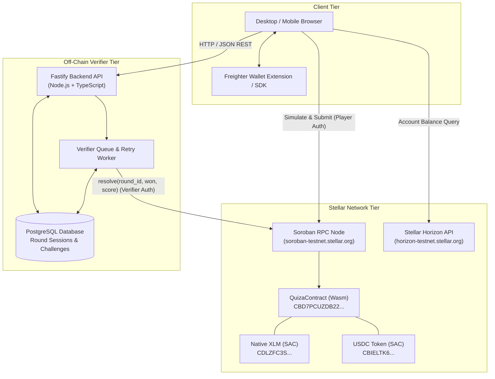
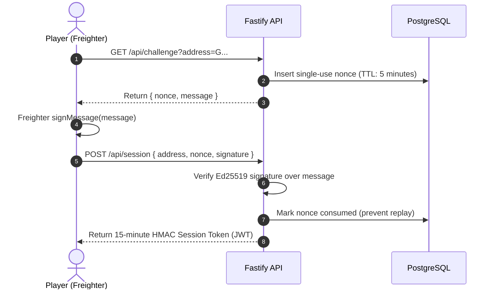

# Quiza System Architecture

This document describes the architectural design, component topology, data flows, and security model of **Quiza**. It is intended for protocol engineers, smart contract auditors, and core contributors.

---

## 1. High-Level Component Topology

Quiza decouples trust, financial settlement, and game logic into distinct architectural tiers:



---

## 2. Core Subsystems

### 2.1. Client Tier (Frontend Web Application)
- **Technology**: React 19, Vite 8, Vanilla CSS / Tailwind tokens.
- **Role**: Renders the game UI, manages timer progression, interfaces with Freighter wallet via `@stellar/freighter-api`, and communicates with both the Soroban RPC and the Fastify backend.
- **Trust Boundary**: Untrusted. The client is considered an adversarial environment. No secret keys or answer keys ever touch the client.

### 2.2. Smart Contract Tier (`contracts/quiza`)
- **Technology**: Rust, Soroban SDK (`soroban-sdk 22.0.0`), compiled to WebAssembly (`wasm32v1-none`).
- **Role**: Non-custodial escrow for player stakes and house liquidity. Manages round creation, payout tier calculations, emergency timeout refunds, and player withdrawals.
- **Trust Boundary**: Highest trust. Enforces cryptographic authorizations (`require_auth()`) and checked mathematical invariants on every ledger transition.

### 2.3. Off-Chain Verifier Tier (`apps/api`)
- **Technology**: Fastify 5, TypeScript 5, PostgreSQL 16.
- **Role**:
  - Issues challenge nonces to verify wallet ownership via Freighter SEP-53 message signatures.
  - Serves sanitized trivia questions (correct answers stripped).
  - Evaluates player answers server-side against source-of-truth database records.
  - Asynchronously signs and broadcasts `resolve(round_id, won, score)` transactions to the Stellar network using the authorized verifier key (`QUIZA_VERIFIER_SECRET_KEY`).
  - Runs background retry sweepers to catch unconfirmed transactions before the 2-hour timeout threshold.

---

## 3. Protocol Data Flows

### 3.1. Staking & Round Initialization

```mermaid
sequenceDiagram
    autonumber
    actor Player as Player (Freighter)
    participant RPC as Soroban RPC
    participant Contract as QuizaContract

    Player->>RPC: simulateTransaction(stake(player, token, amount))
    RPC-->>Player: Simulation Result & Footprint
    Player->>Player: Sign Transaction via Freighter
    Player->>RPC: sendTransaction(signedTx)
    RPC->>Contract: Invoke stake()
    Contract->>Contract: Transfer stake from Player to Contract via SAC
    Contract->>Contract: locked += amount; next_round_id += 1
    Contract-->>RPC: Emit Event (staked, round_id, player)
    RPC-->>Player: Transaction SUCCESS (returns round_id)
```

1. The player selects an asset (XLM or USDC) and stake amount (e.g. 5 XLM).
2. The client builds a Soroban contract call `stake(player, token, amount)` and requests signature from the player's Freighter wallet.
3. The contract transfers tokens from the player to the contract via the Stellar Asset Contract (SAC) client interface.
4. The contract initializes a new persistent storage record `DataKey::Round(round_id)` with `resolved = false`.
5. The state invariant updates: `locked += amount`.

---

### 3.2. Challenge Authentication & Anti-Griefing Flow

To prevent third-party griefing (where an attacker observes an on-chain `round_id` and submits bad answers to fail the round on behalf of the player), Quiza requires cryptographic ownership proof:



1. The client requests a challenge nonce bound to the player's public address (`G...`).
2. The player signs the message via Freighter's standard SEP-53 message signing API.
3. The server validates the Ed25519 cryptographic signature.
4. The server issues a short-lived (15-minute), address-bound HMAC session token stored exclusively in memory in the client.
5. All subsequent calls to `/api/round-questions` and `/api/verify-round` require this session token in the `Authorization: Bearer <token>` header.

---

### 3.3. Gameplay, Off-Chain Scoring & On-Chain Resolution

```mermaid
sequenceDiagram
    autonumber
    actor Player as Player
    participant API as Fastify API
    participant Worker as Verifier Worker
    participant RPC as Soroban RPC
    participant Contract as QuizaContract

    Player->>API: POST /api/round-questions (with Session Token)
    API-->>Player: Return 10 randomized questions (answer keys omitted)
    Player->>Player: Answer questions against 15s timer
    Player->>API: POST /api/verify-round { roundId, answers } (with Session Token)
    API->>API: Evaluate answers against DB; calculate score
    API->>Worker: Enqueue resolution task { roundId, won, score }
    API-->>Player: Return { score, won, status: "pending" }
    
    Worker->>RPC: simulateTransaction(resolve(round_id, won, score))
    Worker->>Worker: Sign with QUIZA_VERIFIER_SECRET_KEY
    Worker->>RPC: sendTransaction(signedTx)
    RPC->>Contract: Invoke resolve()
    Contract->>Contract: Validate verifier authorization
    Contract->>Contract: Calculate payout: locked -= stake; pool -= profit; owed += payout
    Contract->>Contract: round.resolved = true; round.score = score
    Contract-->>RPC: Emit Event (resolved, round_id, player)
    RPC-->>Worker: Transaction confirmed
```

---

## 4. State Invariants & Formal Accounting

### 4.1. Liquidity Invariant
The contract maintains exact accounting for house solvency across all supported tokens:

$$\text{Real SAC Token Balance in Contract} \equiv \text{pool} + \text{locked} + \text{owed}$$

| State Variable | Description | Transition Triggers |
| :--- | :--- | :--- |
| `pool` | Available house liquidity for funding winner payouts | `fund_pool` (+), `withdraw_pool` (-), loss resolution (+), win payout profit (-) |
| `locked` | Sum of stakes in active, unresolved rounds | `stake` (+), `resolve` (-), `claim_timeout` (-) |
| `owed` | Sum of player balances available for withdrawal | win payout (+), timeout refund (+), `withdraw` (-) |

### 4.2. State Transition Table

| Operation | `pool` Change | `locked` Change | `owed` Change | Net Contract Balance Change |
| :--- | :--- | :--- | :--- | :--- |
| `stake(S)` | $0$ | $+S$ | $0$ | $+S$ (transferred in) |
| `resolve(Loss, S)` | $+S$ | $-S$ | $0$ | $0$ |
| `resolve(Win, S, P)` | $-(P - S)$ | $-S$ | $+P$ | $0$ |
| `claim_timeout(S)` | $0$ | $-S$ | $+S$ | $0$ |
| `withdraw(B)` | $0$ | $0$ | $-B$ | $-B$ (transferred out) |
| `fund_pool(A)` | $+A$ | $0$ | $0$ | $+A$ (transferred in) |
| `withdraw_pool(A)`| $-A$ | $0$ | $0$ | $-A$ (transferred out) |

*All transitions preserve $\Delta(\text{Balance}) = \Delta(\text{pool}) + \Delta(\text{locked}) + \Delta(\text{owed})$.*

---

## 5. Security & Threat Mitigation

### 5.1. Front-Running & Griefing
- **Vector**: An attacker monitors the ledger for new `stake` events and attempts to submit answers on the victim's behalf.
- **Mitigation**: Off-chain endpoints require an authenticated session token derived from a Freighter signature over a single-use nonce. The server rejects any request where `token.address != round.player`.

### 5.2. Verifier Key Compromise
- **Vector**: The backend server is compromised and the verifier key is extracted.
- **Mitigation**: The verifier key only has permission to call `resolve()`. It cannot call `withdraw_pool()` or `set_stake_limits()`. Furthermore, resolution payouts are capped by the contract at 2.0x of the active round's stake, preventing arbitrary fund drainage. The admin can immediately rotate the verifier key on-chain via `set_verifier(new_key)`.

### 5.3. Verifier Downtime / Censorship
- **Vector**: The backend crashes or the operator refuses to resolve a round.
- **Mitigation**: The `claim_timeout` method allows players to reclaim 100% of their stake after 7,200 seconds (2 hours) without backend interaction.

### 5.4. Storage TTL Expiration (State Archival)
- **Vector**: Soroban state expires if TTL is not extended, causing contract calls to fail.
- **Mitigation**: Every read and write method in `QuizaContract` invokes `extend_instance_ttl` (for contract instance data) and `extend_persistent_ttl` (for round and balance keys), resetting TTLs to 518,400 ledgers (~30 days). The client pipeline also includes automated `restoreFootprint` execution if an archived state is detected during simulation.
